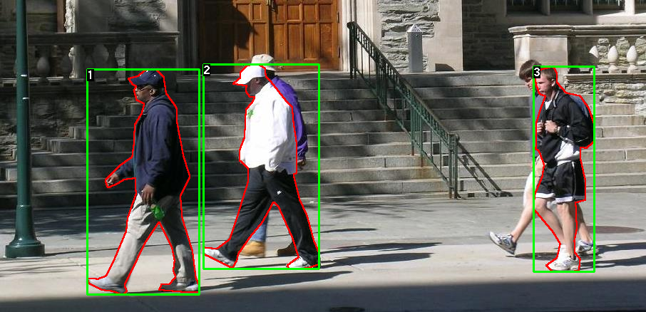

# A Simple Guide to Instance Segmentation

## Datasets  

- **PennPed**: database are used for Pedestrian detection and segmentation. The heights of labeled pedestrians in this database fall into [180,390] pixels. All labeled pedestrians are straight up. There are 170 images with 345 labeled pedestrians.

  

- **COCO:** 
  
  [2017 Train images [118K/18GB\]](http://images.cocodataset.org/zips/train2017.zip)
  [2017 Val images [5K/1GB\]](http://images.cocodataset.org/zips/val2017.zip)
  
  

## Network Architectures  

- [x] (**Mask R-CNN**) Mask R-CNN (2017) [[Paper\]](https://arxiv.org/pdf/1703.06870.pdf)

- [ ] (**YOLACT **) YOLACT: Real-time Instance Segmentation (2019) [[Paper\]](https://arxiv.org/pdf/1904.02689.pdf)

- [ ] (**YolactEdge**) YolactEdge: Real-time Instance Segmentation on the Edge (2020) [[Paper\]](https://arxiv.org/pdf/2012.12259.pdf)

  

## Loss functions

## Evaluation metrics

- 

## REFERENCES

[1] A survey of loss functions for semantic segmentation, 2020, https://arxiv.org/pdf/2006.14822v1.pdf

[2] A Review on Deep Learning Techniques Applied to Semantic Segmentation, 2017,  https://arxiv.org/pdf/1704.06857.pdf

[3] Segmentation Loss Odyssey, 2020, https://arxiv.org/abs/2005.13449