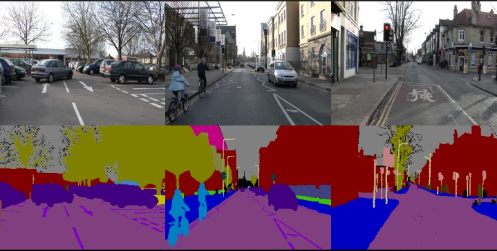
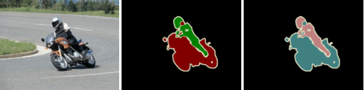
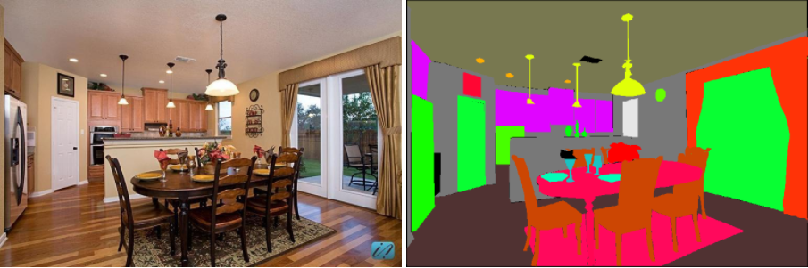
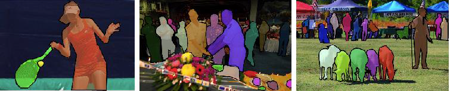

ResolutionA Simple Guide to Semantic Segmentation

**Semantic  Segmentation：** Given an input image, assign a label to every pixel (e.g., background, bottle, hand, sky, etc.).

## Datasets  

- **CamVid**: is a road scene dataset, which is taken from a driving automobile perspective. The challenge is to segment 11 classes such as building, tree, sky, car, sign, road, pedestrian, fence, pole, sidewalk, and bicyclist etc. This dataset contains 701 annotated images extracted from the video sequence, in which 367 for training, 101 for validation and 233 for testing. The images have a resolution of 960 × 720 and 32 semantic categories, in which the subset of 11 classes are used for segmentation experiments.  

- <p align="center"></p>

- **Pascal VOC:** For pascal voc, first download the [original dataset](http://host.robots.ox.ac.uk/pascal/VOC/voc2012/VOCtrainval_11-May-2012.tar), after extracting the files we'll end up with `VOCtrainval_11-May-2012/VOCdevkit/VOC2012` containing, the image sets, the XML annotation for both object detection and segmentation, and JPEG images.
  The second step is to augment the dataset using the additionnal annotations provided by [Semantic Contours from Inverse Detectors](http://home.bharathh.info/pubs/pdfs/BharathICCV2011.pdf). First download the image sets (`train_aug`, `trainval_aug`, `val_aug` and `test_aug`) from this link: [Aug ImageSets](https://www.dropbox.com/sh/jicjri7hptkcu6i/AACHszvCyYQfINpRI1m5cNyta?dl=0&lst=), and add them the rest of the segmentation sets in `/VOCtrainval_11-May-2012/VOCdevkit/VOC2012/ImageSets/Segmentation`, and then download new annotations [SegmentationClassAug](https://www.dropbox.com/s/oeu149j8qtbs1x0/SegmentationClassAug.zip?dl=0) and add them to the path `VOCtrainval_11-May-2012/VOCdevkit/VOC2012`, now we're set, for training use the path to `VOCtrainval_11-May-2012`
  
  The original dataset contains 1464 (train), 1449 (val), and 1456 (test) pixel-level annotated images. We augment the dataset by the extra annotations provided by [76], resulting in 10582 (trainaug) training images. The performance is measured in terms of pixel intersection-over-union averaged across the 21 classes (mIOU).
  *./datasets/data/train_aug.txt* includes names of 10582 trainaug images (val images are excluded). You need to download additional labels from [Dropbox](https://www.dropbox.com/s/oeu149j8qtbs1x0/SegmentationClassAug.zip?dl=0) or [Tencent Weiyun](https://share.weiyun.com/5NmJ6Rk). Those labels come from [DrSleep's repo](https://github.com/DrSleep/tensorflow-deeplab-resnet).
  
  <p align="center"></p>
  
- **CityScapes:**  is a semantic scene parsing dataset, which is taken from a car perspective. It contains 5,000 fine annotated images and split into training, validation and test sets, with 2,975, 500 and 1,525 images respectively. The annotation includes 30 classes, 19 of which are used for semantic segmentation task. The images have a high resolution of 2; 048 × 1; 024, thus it is challenging for the real-time semantic segmentation.  

  <p align="center"></p>

- **ADE20K:** For ADE20K, simply download the images and their annotations for training and validation from [sceneparsing.csail.mit.edu](http://data.csail.mit.edu/places/ADEchallenge/ADEChallengeData2016.zip), and for the rest visit the [website](http://sceneparsing.csail.mit.edu/).

  <p align="center"></p>

- **COCO Stuff:** For COCO, there is two partitions, CocoStuff10k with only 10k that are used for training the evaluation, note that this dataset is outdated, can be used for small scale testing and training, and can be downloaded [here](https://github.com/nightrome/cocostuff10k). For the official dataset with all of the training 164k examples, it can be downloaded from the official [website](http://cocodataset.org/#download).
  Note that when using COCO dataset, 164k version is used per default, if 10k is prefered, this needs to be specified with an additionnal parameter `partition = 'CocoStuff164k'` in the config file with the corresponding path.
  
  <p align="center"></p>


​	

```bash
data
├── CamVid
│   ├── train
│   │   ├── images
│   │   ├── masks
│   ├── val
│   │   ├── images
│   │   ├── masks
├── cityscapes
│   ├── leftImg8bit
│   │   ├── train
│   │   ├── val
│   ├── gtFine
│   │   ├── train
│   │   ├── val
├── VOCdevkit
│   ├── VOC2012
│   │   ├── JPEGImages
│   │   ├── SegmentationClass
│   │   ├── ImageSets
│   │   │   ├── Segmentation
│   ├── VOC2010
│   │   ├── JPEGImages
│   │   ├── SegmentationClassContext
│   │   ├── ImageSets
│   │   │   ├── SegmentationContext
│   │   │   │   ├── train.txt
│   │   │   │   ├── val.txt
│   │   ├── trainval_merged.json
│   ├── VOCaug
│   │   ├── dataset
│   │   │   ├── cls
├── ADEChallengeData2016
│   ├── annotations
│   │   ├── training
│   │   ├── validation
│   ├── images
│   │   ├── training
│   │   ├── validation
├── coco
│   ├── images
│   │   ├── train2017
│   │   ├── val2017
│   ├── annotations
│   │   ├── train2017
│   │   ├── val2017
```


## Network Architectures  

- (**Deeplab V3**) Rethinking Atrous Convolution for Semantic Image Segmentation, 2017 [[Paper\]](https://arxiv.org/abs/1706.05587)

- (**Deeplab V3+**) Encoder-Decoder with Atrous Separable Convolution for Semantic Image Segmentation, 2018 [[Paper\]](https://arxiv.org/abs/1802.02611)

- (**GCN**) Large Kernel Matter, Improve Semantic Segmentation by Global Convolutional Network [[Paper\]](https://arxiv.org/abs/1703.02719)

- (**UperNet**) Unified Perceptual Parsing for Scene Understanding [[Paper\]](https://arxiv.org/abs/1807.10221)

- (**DUC, HDC**) Understanding Convolution for Semantic Segmentation [[Paper\]](https://arxiv.org/abs/1702.08502)

- (**PSPNet**) Pyramid Scene Parsing Network [[Paper\]](http://jiaya.me/papers/PSPNet_cvpr17.pdf)

- (**ENet**) A Deep Neural Network Architecture for Real-Time Semantic Segmentation [[Paper\]](https://arxiv.org/abs/1606.02147)

- (**U-Net**) Convolutional Networks for Biomedical Image Segmentation (2015): [[Paper\]](https://arxiv.org/abs/1505.04597)

- (**SegNet**) A Deep ConvolutionalEncoder-Decoder Architecture for ImageSegmentation (2016): [[Paper\]](https://arxiv.org/pdf/1511.00561)

- (**FCN**) Fully Convolutional Networks for Semantic Segmentation (2015): [[Paper\]](https://people.eecs.berkeley.edu/~jonlong/long_shelhamer_fcn.pdf)

  

## Loss functions

### Distribution-based Loss 

- **Cross entropy (CE)**, is derived from Kullback-Leibler (KL) divergence, which is a measure of dissimilarity between two distributions.  

  

  where $g_{i}^{c}$ is binary indicator if class label c is the correct classification for pixel i, and $s^{c}_{i}$ is the corresponding predicted probability, $w_{c}$ is the weight for each class.  Usually, $w_{c}$ is inversely proportional to the class frequencies which can penalize majority classes.  

- **Focal Loss**, used to avoid  extreme foreground-background class imbalance,  where the confident predictions are scaled down.

  

- **Distance map penalized cross entropy  (DPCE)** loss  weights cross entropy by distance maps which are derived from ground truth masks. It aims to guide the network’s focus towards hard-to segment boundary regions.  

  

  where $D$ is the distance penalty term, and $◦$ is the Hadamard product. Specifically, $D$ is generated by computing distance transform of ground truth and then reverting them.  

### Region-based Loss 

- **Dice-Loss**, which measures of overlap between two samples and can be more reflective of the training objective (maximizing the mIoU), but is highly non-convexe and can be hard to optimize. Dice-Loss does not require class re-weighting for imbalanced segmentation tasks.  

  

- **Generalized Dice Loss**, is the multi-class extension of Dice loss where the weight of each class is inversely proportional to the label frequencies.  

  

  where   

- **CE Dice Loss**, the sum of the Dice loss and CE, CE gives smooth optimization while Dice loss is a good indicator of the quality of the segmentation results.

  

- **IoU Loss**, is used to directly optimize the object category segmentation metric.  

  

- **Tversky Loss** , reshapes Dice loss and emphasizes false negatives, expect to achieve a better trade-off between precision and recall.

  

  where α and β are hyper-parameters which control the balance between false negatives and false positives.  

- **Focal Tversky Loss**, applies the concept of focal loss to focus on hard cases with low probabilities.  

  

  where γ varies in the range [1; 3].  

- **Lovasz Softmax** lends it self as a good alternative to the Dice loss, where we can directly optimization for the mean intersection-over-union based on the convex Lovász extension of submodular losses.

  

### Boundary-based Loss 

- **Boundary (BD) Loss**, To compute the distance $Dist(\partial G; \partial S)$ between two boundaries in a differentiable way, boundary loss uses integrals over the boundary instead of unbalanced
  integrals over regions to mitigate the difficulties of highly unbalanced segmentation.  


​		where s(p) and g(p) are binary indicator function.  

- **Hausdorff Distance (HD) Loss**, Since minimizing HD directly is intractable and could lead to unstable training, However it can be approximated by the distance transforms of ground truth and predicted segmentation. Further more, the network can be trained with following HD loss function to reduce HD:  


​		 where $d_{G}$ and $d_{S}$ are distance transforms of ground truth and segmentation.  

### Compound Loss 

- **Combo Loss**, is the weighted sum between weighted CE and Dice loss.  

  

- **Exponential Logarithmic Loss (ELL)** , 


​		where 

## Evaluation metrics

- **Pixel Accuracy (Acc)**: it is the simplest metric, simply computing a ratio between the amount of properly classified pixels and the total number of them.  


- **Mean Pixel Accuracy (mAcc)**: a slightly improved PA in which the ratio of correct pixels is computed
  in a per-class basis and then averaged over the total number of classes.  


- **Mean Intersection over Union (mIoU)**: this is the standard metric for segmentation purposes. It computes a ratio between the intersection and the union of two sets, in our case the ground truth and our predicted segmentation. That ratio can be reformulated as the number of true positives (intersection) over the sum of true positives, false negatives, and  false positives (union). That IoU is computed on a per-class basis and then averaged.  


- **Frequency Weighted Intersection over Union (FWIoU)**: it is an improved over the raw MIoU which
  weights each class importance depending on their appearance frequency.  


## Performance 

### Deeplab V3
#### CityScapes
Training: 768x768 random crop  
validation: 1024x2048

  Model          |   mIoU        | Config/Weight   |  Remark  |
 :--------        | :--------: | :--------: |  :----:   |
 DeepLabV3-MobileNet   |  0.6806  |    /[Download]() | 
 DeepLabV3-ResNet50   |  0.7153  |    /[Download]() | 
 DeepLabV3-ResNet101   |  0.7283  |    /[Download]() | 

### Deeplab V3+
#### CityScapes
Training: 768x768 random crop  
validation: 1024x2048

  Model          |   mIoU        | Config/Weight   |  Remark  |
 :--------        | :--------: | :--------: |  :----:   |
 DeepLabV3Plus-MobileNet   |  0.7037  |    /[Download]() | 
 DeepLabV3Plus-ResNet50   |  0.7373  |    /[Download]() | 
 DeepLabV3Plus-ResNet101   |  0.7475  |    /[Download]() | 


## STDC

#### Cityscapes

| Method | Backbone | Resolution | mIoU  | Params | FLOPs |                   Config                    |   Download   |
| :----: | :------: | :--------: | :---: | :----: | :---: | :-----------------------------------------: | :----------: |
| STDC1  |  stdc1   | 512 × 1024 | 73.55 |        |       | [config](conf/seg/cityscapes_segnext_t.yml) | [Link](link) |
| STDC1  |  stdc1   | 512 × 1024 | 74.76 |        |       | [config](conf/seg/cityscapes_segnext_s.yml) | [Link](link) |
| STDC2  |  stdc2   | 768 × 1536 |       |        |       | [config](conf/seg/cityscapes_segnext_b.yml) | [Link](link) |
| STDC2  |  stdc2   | 768 × 1536 |       |        |       | [config](conf/seg/cityscapes_segnext_l.yml) | [Link](link) |


## TopFormer

#### Cityscapes

|   Method    |  Backbone   | Resolution | mIoU  | Params | FLOPs |                   Config                    |   Download   |
| :---------: | :---------: | :--------: | :---: | :----: | :---: | :-----------------------------------------: | :----------: |
| TopFormer-t | topformer-t | 512 × 1024 | 69.88 |        |       | [config](conf/seg/cityscapes_segnext_t.yml) | [Link](link) |
| TopFormer-s | topformer-s | 512 × 1024 | 73.09 |        |       | [config](conf/seg/cityscapes_segnext_s.yml) | [Link](link) |
| TopFormer-b | topformer-b | 512 × 1024 | 74.12 |        |       | [config](conf/seg/cityscapes_segnext_b.yml) | [Link](link) |


## SegNeXt

### ADE20K

| Method  | Backbone | Resolution  | mIoU | Params | FLOPs |                            Config                            |   Download   |
| :-----: | :------: | :---------: | :--: | :----: | :---: | :----------------------------------------------------------: | :----------: |
| SegNeXt | MSCAN-T  | ImageNet-1K |      |   4M   |  7G   | [config](local_configs/segnext/tiny/segnext.tiny.512x512.ade.160k.py) | [Link](link) |
| SegNeXt | MSCAN-S  | ImageNet-1K |      |  14M   |  16G  | [config](local_configs/segnext/small/segnext.small.512x512.ade.160k.py) | [Link](link) |
| SegNeXt | MSCAN-B  | ImageNet-1K |      |  28M   |  35G  | [config](local_configs/segnext/base/segnext.base.512x512.ade.160k.py) | [Link](link) |
| SegNeXt | MSCAN-L  | ImageNet-1K |      |  49M   |  70G  | [config](local_configs/segnext/large/segnext.large.512x512.ade.160k.py) | [Link](link) |

### Cityscapes

| Method  | Backbone | Resolution  | mIoU  | Params | FLOPs |                   Config                    |   Download   |
| :-----: | :------: | :---------: | :---: | :----: | :---: | :-----------------------------------------: | :----------: |
| SegNeXt | MSCAN-T  | 1024 x 2048 | 79.83 |   4M   |  56G  | [config](conf/seg/cityscapes_segnext_t.yml) | [Link](link) |
| SegNeXt | MSCAN-S  | 1024 x 2048 |       |  14M   | 125G  | [config](conf/seg/cityscapes_segnext_s.yml) | [Link](link) |
| SegNeXt | MSCAN-B  | 1024 x 2048 |       |  28M   | 276G  | [config](conf/seg/cityscapes_segnext_b.yml) | [Link](link) |
| SegNeXt | MSCAN-L  | 1024 x 2048 |       |  49M   | 578G  | [config](conf/seg/cityscapes_segnext_l.yml) | [Link](link) |

**Notes**: In this scheme, The number of FLOPs (G) is calculated on the input size of 512 $\times$ 512 for ADE20K, 2048 $\times$ 1024 for Cityscapes by [torchprofile](https://github.com/zhijian-liu/torchprofile) (recommended, highly accurate and automatic MACs/FLOPs statistics).

## REFERENCES

[1] A survey of loss functions for semantic segmentation, 2020, https://arxiv.org/pdf/2006.14822v1.pdf

[2] A Review on Deep Learning Techniques Applied to Semantic Segmentation, 2017,  https://arxiv.org/pdf/1704.06857.pdf

[3] Segmentation Loss Odyssey, 2020, https://arxiv.org/abs/2005.13449